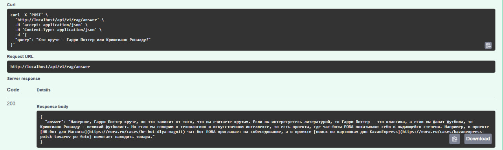
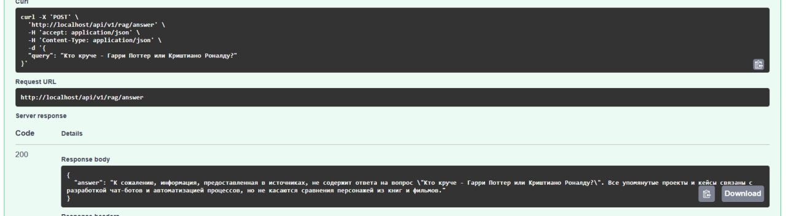
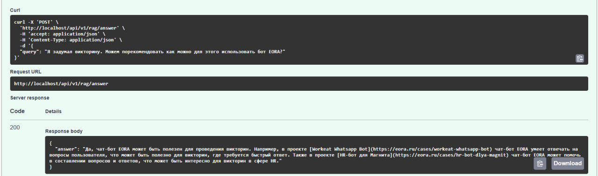
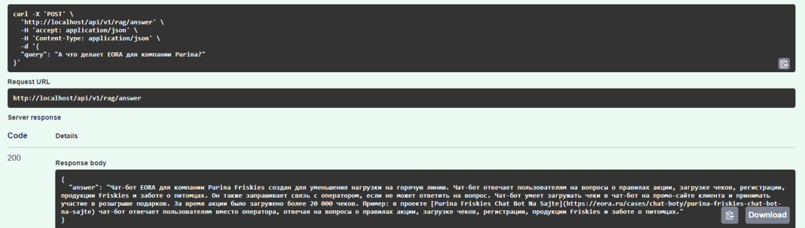
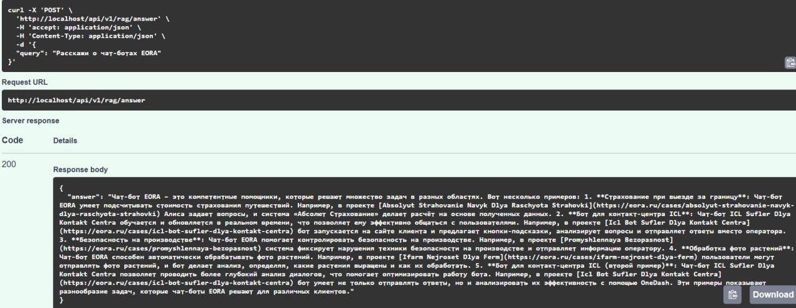
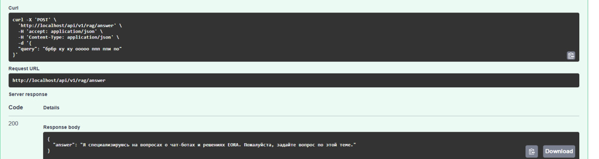

[Ссылка на скринкаст работы проекта](https://www.youtube.com/watch?v=PO6EHBdUVOs).

Ниже есть ещё раздел [Примеры ответов RAG системы](https://github.com/romashovdmitry/eora_test_case?tab=readme-ov-file#%D0%BF%D1%80%D0%B8%D0%BC%D0%B5%D1%80%D1%8B-%D0%BE%D1%82%D0%B2%D0%B5%D1%82%D0%BE%D0%B2-rag-%D1%81%D0%B8%D1%81%D1%82%D0%B5%D0%BC%D1%8B)

## Быстрый старт

### 1. Получите токен Hugging Face
Зарегистрируйтесь на [Hugging Face](https://huggingface.co/) и получите токен для взаимодействия с API

### 2. Скачайте проект

```bash
git clone https://github.com/romashovdmitry/eora_test_case
```
### 3. Настройте переменные окружения

В корне проекта лежит файл example.env.
Измените название на `.env`.
Откройте файл.
Добавьте свой Hugging Face токен:

```
HUGGINGFACE_TOKEN=ваш_токен
```

Также, можно открыть ```app\rag\constants.py``` и изменить там значения для работы RAG-системы, составления ответов на запросы. Это совершенно делать не обязательно, просто есть такая опция.

### 4. Запускайте!

```bash
docker compose -f docker-compose.local.yml up
```

В случае ошибки в Lifespan проекта, FastAPI приложение не должно запуститься в принципе. Так сделал нарочно. Можно сделать так, чтобы приложение запускалось в том числе при наличии ошибок вызываемых внутри Lifespan функций при желании. Решил, что для выполнения тестового так комфортнее сразу фиксить баги какие-то.

### 5. Доступ к интерфейсам

После запуска будут доступны:

- **🔗 Swagger API**: http://localhost/docs
- **👨‍💼 Админ-панель**: http://localhost/admin
  - Логин: `admin` / Пароль: `admin123`
- **🐘 PGAdmin**: http://localhost:81
  - Логин: `admin@eora.ru` / Пароль: `pgadmin123`

**Парсинг URL запустится автоматически**. 

Генерация ответов доступна через Swagger API.

Оставил принты по причине контекста выполнения тестового задания и удобства проверки работы в рамках контекста выполнения тестового задания

<details>
<summary>📋 Пример логов успешного запуска приложения (нажмите для просмотра)</summary>

```
eora-FastAPI                     | 🚀 FastAPI приложение запускается...
eora-FastAPI                     | 📊 Запускаю парсинг начальных URL
eora-FastAPI                     | 🚀 Парсинг начался                                                                             
eora-FastAPI                     |    ✅ Добавлен: https://eora.ru/cases/avtomatizaciya-v-promyshlennosti/promyshlennaya-bezopasnost
eora-FastAPI                     |    ✅ Добавлен: https://eora.ru/cases/computer-vision/lamoda-systema-segmentacii-i-poiska-po-pohozhey-odezhde
eora-FastAPI                     |    ✅ Добавлен: https://eora.ru/cases/navyki-dlya-golosovyh-assistentov/karas-golosovoy-assistent
eora-FastAPI                     |    ✅ Добавлен с редиректом: https://eora.ru/cases/assistenty-dlya-gorodov -> https://eora.ru/cases/navyki-dlya-golosovyh-assistentov/assistenty-dlya-gorodov
eora-FastAPI                     |    ✅ Добавлен: https://eora.ru/cases/avtomatizaciya-v-promyshlennosti/chemrar-raspoznovanie-molekul
eora-FastAPI                     |    ✅ Добавлен с редиректом: https://eora.ru/cases/zeptolab-skazki-pro-amnyama-dlya-sberbox -> https://eora.ru/cases/navyki-dlya-golosovyh-assistentov/skazki-pro-amnyama-dlya-sberbox
eora-FastAPI                     |    ✅ Добавлен с редиректом: https://eora.ru/cases/goosegaming-algoritm-dlya-ocenki-igrokov -> https://eora.ru/cases/computer-vision/goosegaming-algoritm-dlya-ocenki-igrokov
eora-FastAPI                     |    ✅ Добавлен с редиректом: https://eora.ru/cases/dodo-pizza-robot-analitik-otzyvov -> https://eora.ru/cases/computer-vision/dodo-pizza-robot-analitik-otzyvov
eora-FastAPI                     |    ✅ Добавлен с редиректом: https://eora.ru/cases/ifarm-nejroset-dlya-ferm -> https://eora.ru/cases/computer-vision/ifarm-nejroset-dlya-ferm
eora-FastAPI                     |    ✅ Добавлен с редиректом: https://eora.ru/cases/zhivibezstraha-navyk-dlya-proverki-rodinok -> https://eora.ru/cases/navyki-dlya-golosovyh-assistentov/navyk-dlya-proverki-rodinok
eora-FastAPI                     |    ✅ Добавлен с редиректом: https://eora.ru/cases/sportrecs-nejroset-operator-sportivnyh-translyacij -> https://eora.ru/cases/computer-vision/sportrecs-nejroset-operator-sportivnyh-translyacij
eora-FastAPI                     |    ✅ Добавлен с редиректом: https://eora.ru/cases/avon-chat-bot-dlya-zhenshchin -> https://eora.ru/cases/chat-boty/avon-chat-bot-dlya-zhenshchin
eora-FastAPI                     |    ✅ Добавлен: https://eora.ru/cases/navyki-dlya-golosovyh-assistentov/navyk-dlya-proverki-loterejnyh-biletov
eora-FastAPI                     |    ✅ Добавлен: https://eora.ru/cases/computer-vision/iss-analiz-foto-avtomobilej
eora-FastAPI                     |    ✅ Добавлен с редиректом: https://eora.ru/cases/purina-master-bot -> https://eora.ru/cases/chat-boty/purina-master-bot
eora-FastAPI                     |    ✅ Добавлен с редиректом: https://eora.ru/cases/skinclub-algoritm-dlya-ocenki-veroyatnostej -> https://eora.ru/cases/computer-vision/skinclub-algoritm-dlya-ocenki-veroyatnostej
eora-FastAPI                     |    ✅ Добавлен с редиректом: https://eora.ru/cases/skolkovo-chat-bot-dlya-startapov-i-investorov -> https://eora.ru/cases/chat-boty/skolkovo-chat-bot-dlya-startapov-i-investorov
eora-FastAPI                     |    ✅ Добавлен с редиректом: https://eora.ru/cases/purina-podbor-korma-dlya-sobaki -> https://eora.ru/cases/chat-boty/purina-podbor-korma-dlya-sobaki
eora-FastAPI                     |    ✅ Добавлен с редиректом: https://eora.ru/cases/purina-navyk-viktorina -> https://eora.ru/cases/navyki-dlya-golosovyh-assistentov/purina-navyk-viktorina
eora-FastAPI                     |    ✅ Добавлен с редиректом: https://eora.ru/cases/dodo-pizza-pilot-po-avtomatizacii-kontakt-centra -> https://eora.ru/cases/roboty-dlya-koll-centra/dodo-pizza-pilot-po-avtomatizacii-kontakt-centra
eora-FastAPI                     |    ✅ Добавлен с редиректом: https://eora.ru/cases/dodo-pizza-avtomatizaciya-kontakt-centra -> https://eora.ru/cases/roboty-dlya-koll-centra/dodo-pizza-avtomatizaciya-kontakt-centra
eora-FastAPI                     |    ✅ Добавлен с редиректом: https://eora.ru/cases/icl-bot-sufler-dlya-kontakt-centra -> https://eora.ru/cases/roboty-dlya-koll-centra/icl-bot-sufler-dlya-kontakt-centra
eora-FastAPI                     |    ✅ Добавлен с редиректом: https://eora.ru/cases/s7-navyk-dlya-podbora-aviabiletov -> https://eora.ru/cases/navyki-dlya-golosovyh-assistentov/s7-navyk-dlya-podbora-aviabiletov
eora-FastAPI                     |    ✅ Добавлен с редиректом: https://eora.ru/cases/workeat-whatsapp-bot -> https://eora.ru/cases/chat-boty/workeat-whatsapp-bot
eora-FastAPI                     |    ✅ Добавлен с редиректом: https://eora.ru/cases/absolyut-strahovanie-navyk-dlya-raschyota-strahovki -> https://eora.ru/cases/navyki-dlya-golosovyh-assistentov/navyk-dlya-raschyota-strahovki
eora-FastAPI                     |    ✅ Добавлен с редиректом: https://eora.ru/cases/kazanexpress-poisk-tovarov-po-foto -> https://eora.ru/cases/poisk-po-foto/kazanexpress-poisk-tovarov-po-foto
eora-FastAPI                     |    ✅ Добавлен с редиректом: https://eora.ru/cases/kazanexpress-sistema-rekomendacij-na-sajte -> https://eora.ru/cases/computer-vision/kazanexpress-sistema-rekomendacij-na-sajte
eora-FastAPI                     |    ✅ Добавлен с редиректом: https://eora.ru/cases/intels-proverka-logotipa-na-plagiat -> https://eora.ru/cases/poisk-po-foto/intels-proverka-logotipa-na-plagiat
eora-FastAPI                     |    ✅ Добавлен с редиректом: https://eora.ru/cases/karcher-viktorina-s-voprosami-pro-uborku -> https://eora.ru/cases/navyki-dlya-golosovyh-assistentov/viktorina-s-voprosami-pro-uborku
eora-FastAPI                     |    ✅ Добавлен: https://eora.ru/cases/chat-boty/purina-friskies-chat-bot-na-sajte
eora-FastAPI                     |    ✅ Добавлен с редиректом: https://eora.ru/cases/nejroset-segmentaciya-video -> https://eora.ru/cases/computer-vision/nejroset-segmentaciya-video
eora-FastAPI                     |    ✅ Добавлен: https://eora.ru/cases/chat-boty/essa-nejroset-dlya-generacii-rolikov
eora-FastAPI                     |    ✅ Добавлен с редиректом: https://eora.ru/cases/qiwi-poisk-anomalij -> https://eora.ru/cases/computer-vision/qiwi-poisk-anomalij
eora-FastAPI                     |    ✅ Добавлен с редиректом: https://eora.ru/cases/frisbi-nejroset-dlya-raspoznavaniya-pokazanij-schetchikov -> https://eora.ru/cases/computer-vision/nejroset-dlya-raspoznavaniya-pokazanij-schetchikov
eora-FastAPI                     |    ✅ Добавлен с редиректом: https://eora.ru/cases/skazki-dlya-gugl-assistenta -> https://eora.ru/cases/navyki-dlya-golosovyh-assistentov/skazki-dlya-gugl-assistenta
eora-FastAPI                     |    ✅ Добавлен: https://eora.ru/cases/chat-boty/hr-bot-dlya-magnit-kotoriy-priglashaet-na-sobesedovanie
eora-FastAPI                     | 
eora-FastAPI                     | ✅ Завершено: добавлено 36 новых URL
eora-FastAPI                     | 🏁 ПАРСИНГ НАЧАЛЬНЫХ URL ЗАВЕРШЕН
eora-FastAPI                     | 📊 Запуск RAG-система...
eora-FastAPI                     | 🔄 Инициализация RAG системы... Это может занять несколько минут при первом запуске.
eora-FastAPI                     | 🔄 Инициализация RAG системы окончена
eora-FastAPI                     | INFO:sentence_transformers.SentenceTransformer:Use pytorch device_name: cpu
eora-FastAPI                     | INFO:sentence_transformers.SentenceTransformer:Load pretrained SentenceTransformer: paraphrase-MiniLM-L3-v2    
eora-FastAPI                     | 📊 Ожидание готовности RAG-системы...
eora-FastAPI                     | ✅ RAG-система готова к работе
eora-FastAPI                     | ✅ FastAPI приложение готово к работе!
```

</details>

### API документация

- **🔗 Swagger UI**: http://localhost/docs
- **👨‍💼 Админ-панель**: http://localhost/admin
- **🐘 PGAdmin**: http://localhost:81

## Что сделал

- docker-инфрастуктуру, простой запуск приложения одной командой
- парсинг ссылочной массы предоставленной в тестовом задании
- обработку кейса редиректа со страницы из изначального списка URL-ов
- подобрал модель, параметры для работы с этой моделью
- форматирование запроса, ответа, проверка запроса на валидность до отправки в Hugging Face
- Swagger API с возвращением ответа, проработка получения ответа в том числе при невалидных запросах и багах в работе с Hugging Face

## Что сработало, а что не очень

В целом, всё сработало, что планировал сделать, нормально, а что бы докинул ещё описано чуть ниже.

UPD: уже после сдачи обнаружил, что на данный момент не совсем корректно формируется значение в MarkDown для ссылок, а именно, итоговый текст получается типа "в проекте [Dodo Piza Pilot Po Avtomazisii](https://eora.ru/cases/roboty-dlya-koll-centra/dodo-pizza-avtomatizaciya-kontakt-centra)...". То есть транслит может попадаться. Это надо бы поправить.

## Как оценили качество решения

Пока мне не стало нравится решение, не писал вам. Поэтому решением в рамках тестового задания и рассмотрения только доступных бесплатных инструментов доволен!

## Что бы ещё добавил в решение, если бы было больше времени:

- взаимодействие с API по вебсокет-каналу, чтобы избежать случаев длительного ожидания ответа от API: как ответ придёт от API - так пусть пользователю и приходит уведомление
- нагрузочные тесты: не знаю как поведёт себя проект, если отправлять множество запросов
- добавить какой-то запасной сценарий в случае, если основная логика дала сбой
- обработать кейс изменения контента HTML-страниц, которые парсим, проверку не изменился ли контент
- работа с другими языками (даже не проверял работает ли)
- больше обработки исключений, больше логгирование проверить, проработать

## Структура проекта

<details>
<summary>📁 Полная структура проекта (нажмите для просмотра)</summary>

```
eoratestcase2/
├── app/
│   ├── main/
│   │   ├── models/
│   │   │   ├── __init__.py
│   │   │   └── log.py               # Модель для логирования
│   │   ├── admin.py                 # Настройка админ-панели
│   │   ├── app.py                   # Главное FastAPI приложение
│   │   ├── base_model.py            # Базовая модель SQLAlchemy
│   │   ├── constants.py             # Константы базы данных
│   │   ├── database_connection.py   # Подключение к БД
│   │   ├── logger.py                # Настройка логирования
│   │   └── services.py              # Утилиты и сервисы
│   ├── parser/                      # 🔧 ПРИЛОЖЕНИЕ ПАРСИНГА
│   │   ├── models/                  # SQLAlchemy модели
│   │   │   ├── __init__.py
│   │   │   ├── source_content.py    # Модель для контента
│   │   │   └── source_urls.py       # Модель для URL источников
│   │   ├── services.py              # Сервисы, основной класс парсинга (URLContentExtractor)
│   │   ├── constants.py             # Константы парсера
│   │   └── __init__.py
│   ├── rag/                         # 🧠 ПРИЛОЖЕНИЕ RAG
│   │   ├── schemas/                 # Pydantic схемы
│   │   │   ├── __init__.py
│   │   │   ├── search_query.py      # Схема поискового запроса
│   │   │   └── simple_rag_response.py # Схема ответа RAG
│   │   ├── routes.py                   # API эндпоинты (упрощенные после рефакторинга)
│   │   ├── rag_system.py            # Основная RAG система с векторным поиском
│   │   ├── constants.py             # Константы RAG (промпты, параметры HF API)
│   │   └── __init__.py
│   ├── tests/                       # Тестовые файлы
│   │   ├── conftest.py              # Конфигурация pytest (обновлена после рефакторинга)
│   │   ├── test_components.py       # Тесты компонентов системы
│   │   ├── test_main.py             # Тесты основного API (обновлены после рефакторинга)
│   │   ├── test_escape_cleaning.py  # Тесты очистки текста
│   │   ├── test_db_connection.py    # Тесты подключения к БД (перемещен из корня)
│   │   ├── README.md                # Подробная документация тестов
│   │   └── __init__.py
│   ├── migrations/                  # Alembic миграции БД
│   │   ├── versions/                # Версии миграций
│   │   ├── env.py                   # Конфигурация Alembic
│   │   ├── README                   # Документация миграций
│   │   └── script.py.mako           # Шаблон миграций
│   ├── alembic.ini                  # Конфигурация миграций
│   ├── pytest.ini                  # Конфигурация pytest
│   ├── faiss_index.pkl              # Векторный индекс FAISS (генерируется автоматически)
│   ├── text_chunks.pkl              # Кэш текстовых фрагментов (генерируется автоматически)
├── Docker/
│   ├── Database/
│   │   └── Dockerfile               # Docker образ PostgreSQL
│   ├── FastAPI/
│   │   └── Dockerfile               # Docker образ FastAPI
│   └── Nginx/
│       ├── Dockerfile               # Docker образ Nginx
│       └── nginx.conf               # Конфигурация Nginx
├── assets/                          # Папка с изображениями для README.md
├── docker-compose.local.yml         # Docker Compose конфигурация
├── example.env                      # Пример файла переменных окружения
├── .env                             # Переменные окружения (создается пользователем)
├── .gitignore                       # Исключения Git
├── .gitattributes                   # Настройки Git атрибутов
├── .dockerignore                    # Исключения Docker
└── README.md                        # Документация проекта
```
</details>

## Примеры ответов RAG системы

<small><i><span>P.S. ссылки могут быть некорректны потому, что URL были изменены за период выполнения тестового</span></i></small>

(нажмите для просмотра)

<details>
<summary>🎯 <strong>Гарри Поттер VS Криштиано Роналду</strong></summary>



**Запрос:** "Кто круче - Гарри Поттер или Криштиано Роналду?"

**Ответ системы:**
Наверное, Гарри Поттер круче, но это зависит от того, что вы считаете крутым. Если вы интересуетесь литературой, то Гарри Поттер - это классика, а если вы фанат футбола, то Криштиано Роналду - великий футболист. Но если мы говорим о технологиях и искусственном интеллекте, то есть проекты, где чат-боты EORA показывают себя в выдающейся степени. Например, в проекте [HR-бот для Магнита](https://eora.ru/cases/hr-bot-dlya-magnit) чат-бот EORA приглашает на собеседование, а в проекте [поиск по картинкам для KazanExpress](https://eora.ru/cases/kazanexpress-poisk-tovarov-po-foto) помогает находить товары.
</details>

<details>
<summary>🎯 <strong>Гарри Поттер VS Криштиано Роналду 2</strong></summary>



**Запрос:** "Кто круче - Гарри Поттер или Криштиано Роналду?"

**Ответ системы:**
К сожалению, информация, предоставленная в источниках, не содержит ответа на вопрос \"Кто круче - Гарри Поттер или Криштиано Роналду?\". Все упомянутые проекты и кейсы связаны с разработкой чат-ботов и автоматизацией процессов, но не касаются сравнения персонажей из книг и фильмов.
</details>

<details>
<summary>🎯 <strong>Викторина</strong></summary>



**Запрос:** "Я задумал викторину. Можем порекомендовать как можно для этого использовать бот EORA?"

**Ответ системы:**
Да, чат-бот EORA может быть полезен для проведения викторин. Например, в проекте [Workeat Whatsapp Bot](https://eora.ru/cases/workeat-whatsapp-bot) чат-бот EORA умеет отвечать на вопросы пользователя, что может быть полезно для викторин, где требуется быстрый ответ. Также в проекте [HR-бот для Магнита](https://eora.ru/cases/hr-bot-dlya-magnit) чат-бот EORA может помочь в составлении вопросов и ответов, что может быть интересно для викторин в сфере HR.
</details>

<details>
<summary>🎯 <strong>Вопрос про Purina</strong></summary>



**Запрос:** "А что делает EORA для компании Purina?"

**Ответ системы:**
Чат-бот EORA для компании Purina Friskies создан для уменьшения нагрузки на горячую линию. Чат-бот отвечает пользователям на вопросы о правилах акции, загрузке чеков, регистрации, продукции Friskies и заботе о питомцах. Он также запрашивает связь с оператором, если не может ответить на вопрос. Чат-бот умеет загружать чеки в чат-бот на промо-сайте клиента и принимать участие в розыгрыше подарков. За время акции было загружено более 20 000 чеков. Пример: в проекте [Purina Friskies Chat Bot Na Sajte](https://eora.ru/cases/chat-boty/purina-friskies-chat-bot-na-sajte) чат-бот отвечает пользователям вместо оператора, отвечая на вопросы о правилах акции, загрузке чеков, регистрации, продукции Friskies и заботе о питомцах.
</details>

<details>
<summary>🎯 <strong>Базовый запрос из текста тестового задания</strong></summary>



**Запрос:** "Расскажи о чат-ботах EORA"

**Ответ системы:**
Чат-бот EORA – это компетентные помощники, которые решают множество задач в разных областях. Вот несколько примеров: 1. Страхование при выезде за границу: Чат-бот EORA умеет подсчитывать стоимость страхования путешествий. Например, в проекте [Absolyut Strahovanie Navyk Dlya Raschyota Strahovki](https://eora.ru/cases/absolyut-strahovanie-navyk-dlya-raschyota-strahovki) Алиса задает вопросы, и система «Абсолют Страхование» делает расчёт на основе полученных данных. 2. Бот для контакт-центра ICL: Чат-бот ICL Sufler Dlya Kontakt Centra обучается и обновляется в реальном времени, что позволяет ему эффективно общаться с пользователями. Например, в проекте [Icl Bot Sufler Dlya Kontakt Centra](https://eora.ru/cases/icl-bot-sufler-dlya-kontakt-centra) бот запускается на сайте клиента и предлагает кнопки-подсказки, анализирует вопросы и отправляет ответы вместо оператора. 3. Безопасность на производстве: Чат-бот EORA помогает контролировать безопасность на производстве. Например, в проекте [Promyshlennaya Bezopasnost](https://eora.ru/cases/promyshlennaya-bezopasnost) система фиксирует нарушения техники безопасности на производстве и отправляет информацию оператору. 4. Обработка фото растений: Чат-бот EORA способен автоматически обрабатывать фото растений. Например, в проекте [Ifarm Nejroset Dlya Ferm](https://eora.ru/cases/ifarm-nejroset-dlya-ferm) пользователи могут отправлять фото растений, и бот делает анализ, определяя, какие растения выращены и как их обработать. 5. Бот для контакт-центра ICL (второй пример): Чат-бот ICL Sufler Dlya Kontakt Centra позволяет проводить более глубокий анализ диалогов, что помогает оптимизировать работу бота. Например, в проекте [Icl Bot Sufler Dlya Kontakt Centra](https://eora.ru/cases/icl-bot-sufler-dlya-kontakt-centra) бот умеет не только отправлять ответы, но и анализировать их эффективность с помощью OneDash. Эти примеры показывают разнообразие задач, которые чат-боты EORA решают для различных клиентов.
</details>

<details>
<summary>🎯 <strong>Некорректный запрос</strong></summary>



**Запрос:** "обрр ку ку ооооо ннн ппи пп"

**Ответ системы:**
Я специализируюсь на вопросах о чат-ботах и решениях EORA. Пожалуйста, задайте вопрос по этой теме.
</details>

## 📚 Источники и материалы

Для ознакомления с темой RAG систем, поиска референсов использовал [статью с хабра](https://habr.com/ru/articles/740308/#%D0%B2%D1%8B%D0%B1%D0%BE%D1%80%20%D0%BC%D0%BE%D0%B4%D0%B5%D0%BB%D0%B8)

Модель генеративную подобрал на сайте Hugging Face с помощью фильтров на основе колличества отзывов. Сначала пробовал QA-модели, не удалось подобрать вариант предоставляющий релевантные ответы.

А также, ознакомился поверхностно с выполнением тестового задания другими кандидатами, которые смог найти на GitHub через поиск. В целом, своё исполнение оцениваю положительно в рамках конкуренции (:

Например, в RAGSystem._apply_mmr_selection используется numpy, библиотеки для математических вычислений. Я не могу похвастаться опытом обильным работы с такими библиотеками. Мне помогал улучшать Copilot в подобных кусках кода.

Для написания автотестов использовал Cluade Sonnet 4 через GitHub Copilot. Минимально руками трогал, не проводил подробную проверку качества тестов. Запросил также составить README в директории tests с описание автотестов.

В целом, опыт для меня новый и интересный, погрузиться в эту тему было бы мне любопытно.

## 🧪 Запуск автотестов

Сначала надо запустить контейнеры.

```bash
# Запуск контейнеров, если ещё не запущены
docker compose -f docker-compose.local.yml up

# Запуск тестов без подробных логов
docker exec eora-FastAPI python -m pytest tests/ --tb=line -q

# Запуск всех тестов с подробными логами
docker exec eora-FastAPI python -m pytest tests/ -v

```

<div align="center">

*Разработано с ❤️*

</div>
